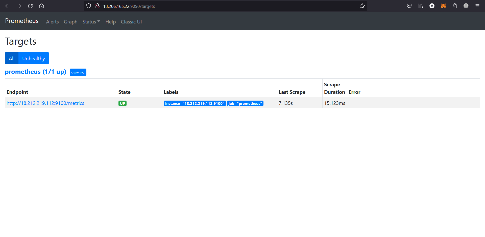
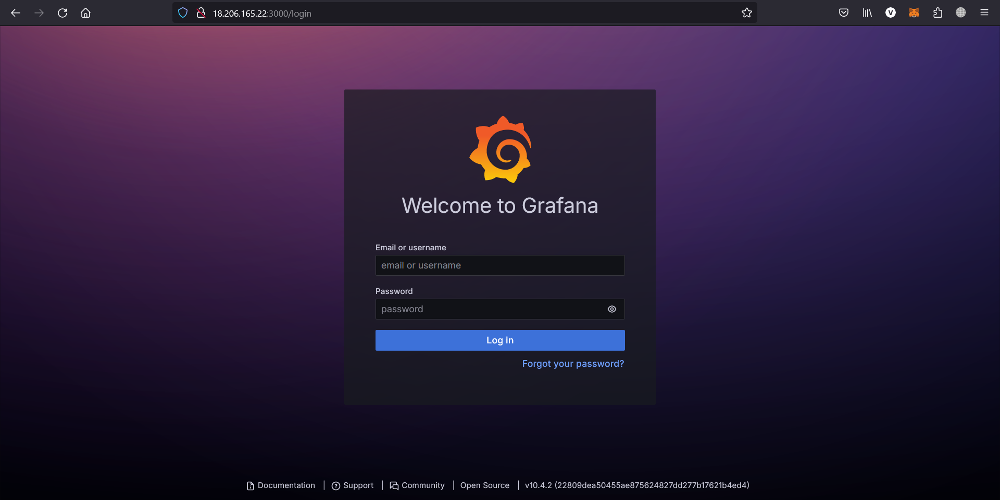
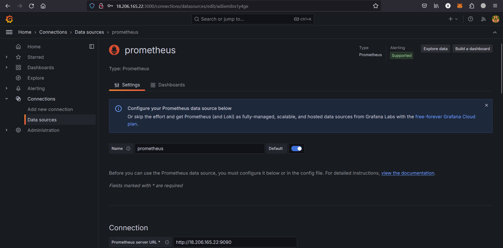
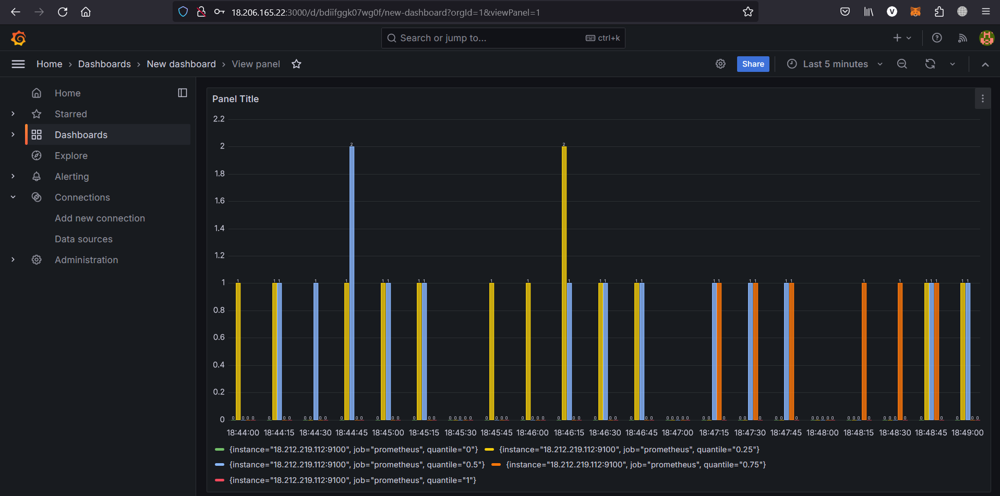

# Promethues-Grafana-Setup
This repo is shows us how to install prometheus and grafana on AWS-EC2 (Ubuntu).

## Getting started

## Agenda
1.  Install Prometheus and configure Prometheus to monitor itself
2.  Install Node Exporter on other EC2 Instances i.e. Pormetheus_server
3.  Configure Prometheus for the EC2 Instance i.e. Target_server
4.  Install Grafana

##  Prerequisite:
1.  Prometheus EC2 instance t2.micro 
2.  Node EC2 instances to monitor
3.  Security Groups Configured properly
4.  Clone this git repo

### Security Groups Configured on EC2 Instances
Port 9090 — Prometheus Server
Port 9100 — Prometheus Node Exporter
Port 3000 — Grafana

##  Install Prometheus
Prometheus is an open source tool for monitoring and alerting applications.
Now we will install the Prometheus on one of the EC2 Instance. You can download the latest version from [here](https://prometheus.io/download/).

1.  Clone my git repo
2.  Run the install-prometheus.sh script
```shell
./install-prometheus.sh
```
3.  This script will install everything and configured it. You can change the version as per your project.

##  Install Node Exporter

Now to monitor your servers you need to install the node exporter on all your target machine which is like a monitoring agent on all the servers.

You can clone this repo and run it directly using below command
Run in this directory to build and run the app:
```shell
./install-node-exporter.sh
```
##  Configure Prometheus for the Nodes
Now we will configure the Prometheus for our EC2 instance where we have installed the node-exporter. Login to the Prometheus server and edit the file or you can clone this file/etc/prometheus/prometheus.yml

Change target value from localhost to your node-exporter IP
```shell
sudo vim /etc/prometheus/prometheus.yml
```
```shell
- targets: ['Pub-IP:9100']
```
Restart the Prometheus server
```shell
sudo systemctl restart prometheus
sudo systemctl status prometheus
```



##  Install Grafana

Once Prometheus is installed successfully then we can install the Grafana and configure Prometheus as a datasource. Grafana is an opensource tool which is used to provide the visualization of your metrics. 
You can download the latest version of Grafana from [here](https://grafana.com/grafana/download)

Run the below file
```shell
./install-grafana.sh
```
Make sure that port 3000 is open for this instance.
```shell
http://yourip:3000
```
Login with username : $${\color{red}admin}$$ and password  : $${\color{red}admin}$$




While creating Data Soruce in Grafana make sure to give your Prometheus server pub-ip:9090 in Prometheus server URL





You can import Different dashboards from [here](https://grafana.com/grafana/dashboards/)

After that copy the ID of the Dashboard. Open the Import section from Dashboard and paste it in the dashboard id box.


##  Conclusion:

We have successfully learnt how to monitor the AWS EC2 instances using Prometheus and visualize the dashboard using Grafana.
